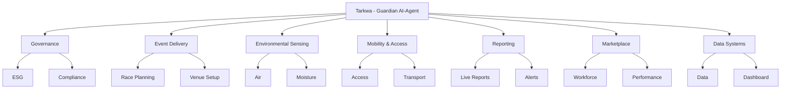

# Jabi Lake AI-ESG Triathlon  
## AI-Agent Workforce Organogram

## Organisational Principle

The AI-Agent Workforce is organized as a hierarchical command system led by **Tarkwa**, the Guardian AI-Agent.

